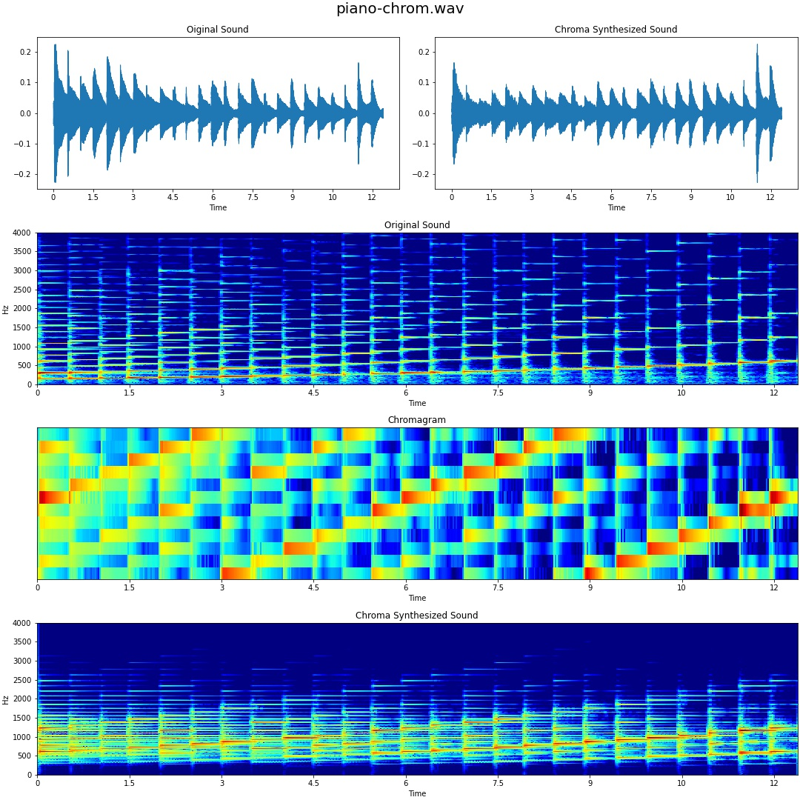
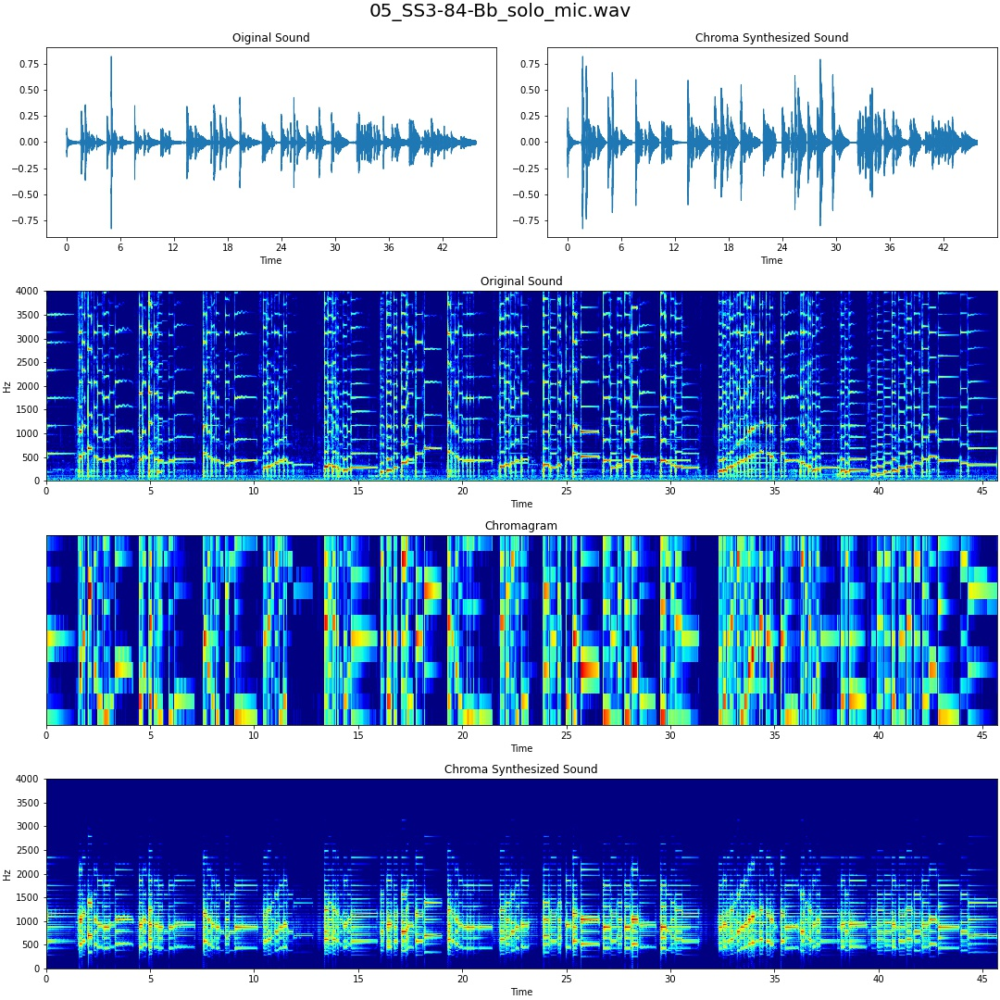

# Chroma Synthesis
### Python Implementation of Chroma Synthesis  
#### **You can see original Matlab code in https://www.ee.columbia.edu/~dpwe/e4896/outline.html  .**

 

## Examples
Sample Data Source
* piano-chrom.wav: https://www.ee.columbia.edu/~dpwe/e4896/outline.html  
* 05_SS3-84-Bb_solo_mic.wav: https://zenodo.org/record/3371780  

## Reference
> [1] Ellis, Daniel P.W. “Chroma feature analysis and synthesis” https://www.ee.columbia.edu/~dpwe/e4896/outline.html  